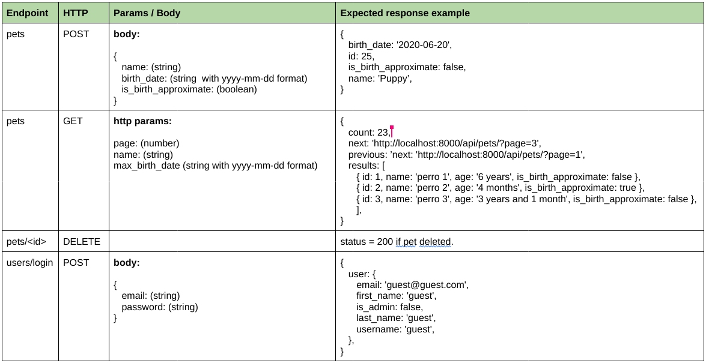

# irobot-exercise
## Introduction
Pets-app is a frontend application where you can:
- Create new pets.
- See all pets created by users.
- Delete pets (only if you are admin).

Sadly we don't have a backend developer and we can't do any of these functionalities :(.
We need you to create a Restful API with its corresponding endpoints to make our app work. You can do it!
## Exercise
Given the frontend app attached in this repo, create a Restful API with the following features:
- Create a pet. The age can be approximated or exact. (Pet model should have a flag indicating if birthdate is approximated or exact)
- List pets by name and age.
- Delete pets. (Only admin users can delete pets).
- User login and sign in.
- EXTRA POINTS: make a script that seed the database with some pets and two users (admin and guest).

This API must be able to be consumed by the frontend app.
In other words, you have to create the necessary endpoints to make the frontend app work.

## Necessary endpoints

Backend must be running on port 8000, and here is some information about the endpoints you need to implement in order to make the right integration with the given Frontend app.

Backend base url that the frontend app is trying to consume is: `http://localhost:8000/api/`



_See the `endpoint-information.jpg` attached to this repo._

You can also check the frontend code if you need more information to integrate the requested API with the frontend app.

**NOTE:** When retrieving pets we need the pet's age instead of its date of birth. This must be handled by the API.

The exercise must be done using Django Rest Framework (DRF) and its documentation must be in English, indicating how to run the API locally in Ubuntu Linux 18.04 or higher version.

# How to run the frontend app
## Run the frontend app with docker-compose <a name="docker"></a>
A docker-compose.yml file is provided to run the app in a containerized environment.
From the root directory of this repo, run:
```
docker-compose -f ./dockerization/docker-compose.yml up
```

_Info on how to install docker-compose [here](https://docs.docker.com/compose/install/)._

## Run the frontend app locally:
```
cd src/frontend
npm i
ng serve
```
_Info on how to install Angular [here](https://angular.io/guide/setup-local#prerequisites)_